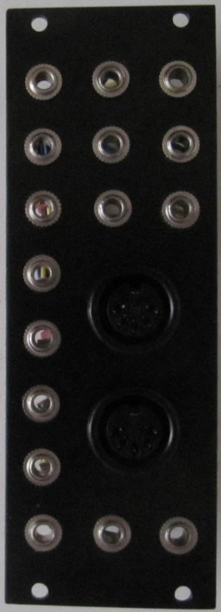
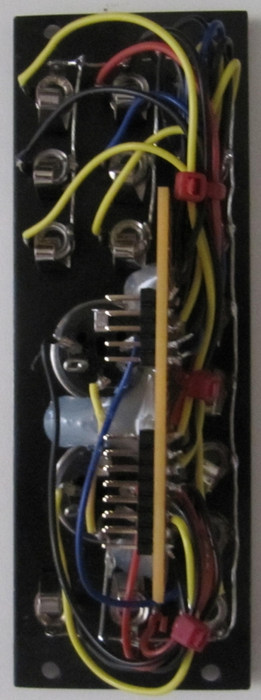
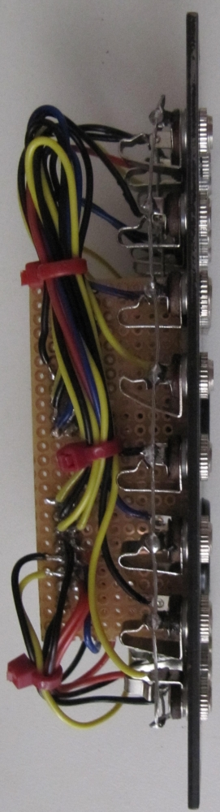
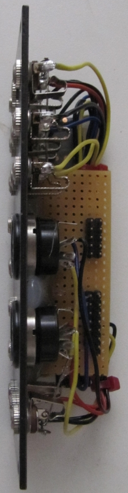
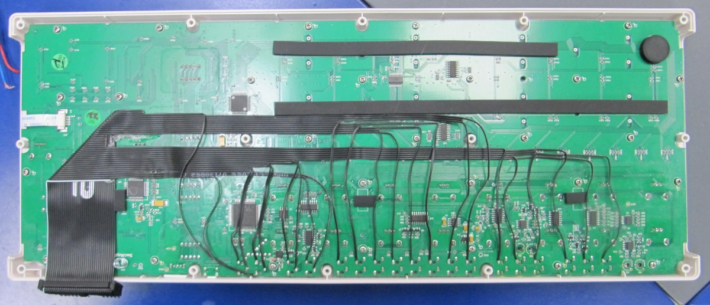
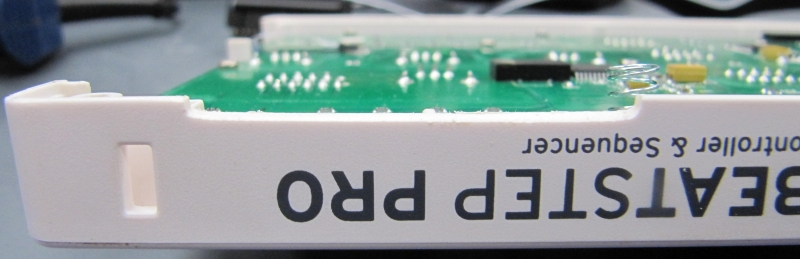
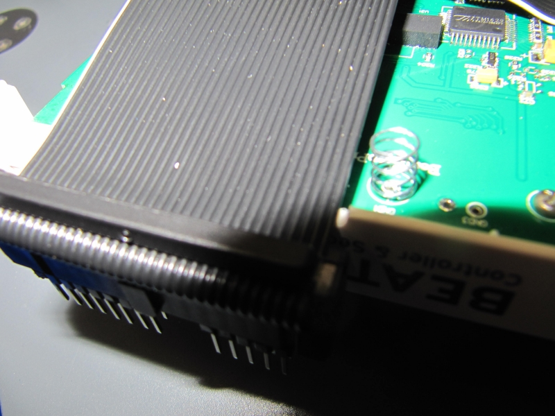
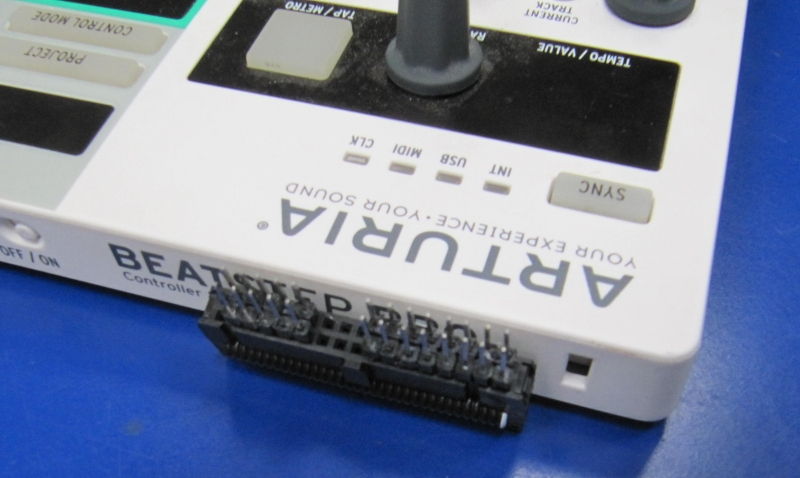

# beatstep-pro-breakout
eurorack breakout module for Arturia Beatstep Pro

If you use the [Arturia Beatstep Pro](https://www.arturia.com/products/hybrid-synths/beatstep-pro/overview) together with your eurorack this project may be interesting for you.  

With a few bucks for material you can create an eurorack module that provides all CV jacks directly inide your rack.  
So there is no need to fiddle around on the backside located jacks of your Arturia Beatstep Pro. 

I choosed to use 2 seperate cables so theoretically you can place all drum gates in a separate module in your rack.  

# the passive module

# modifications of the Arturia Beatstep Pro
  
  
  
  

see my other [eurorack DIY projects](https://github.com/othmar52/eurorack)
